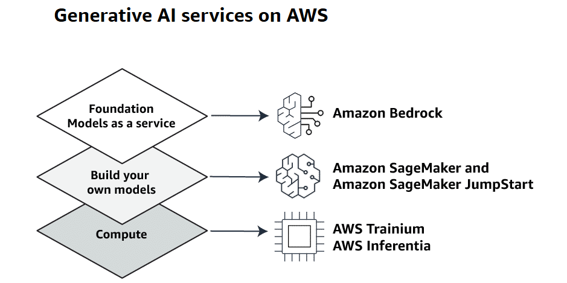

Type of bias

Bias is a tendency to favor or disfavor certain characteristics that can lead to distorted outputs and potentially harmful outcomes. In AI, bias results from human biases that skew the original training data or AI algorithm.

Review the following examples of types of bias in generative AI.

•
Cognitive bias - Generative AI might include biased decisions about the data to include in developing AI, how AI gets used, and to whom it becomes available.

•
Confirmation bias - Generative AI might reinforce flawed ideas or biases by providing the views or representations that you expect.

•
Cultural biases - Data sets and model training might include prejudices and stereotypes.

•
Dataset biases - When you choose datasets, it might be easier to use readily available data rather than to seek out data that better represents a population.

•
Demographic biases - When you train LLMs, they might over-represent or under-represent characteristics of race, gender, ethnicity, and social groups.

•
Political biases - Generative AI might reflect the political or ideological biases of the training materials.

•
Language biases - Online content appears most often in English and a few other languages, so generative AI models mostly reflect those languages.

•
Statistical biases -  All statistical models and technological systems require assumptions from system designers, which affects who and what gets counted and who and what doesn't get counted.

•
Systems bias - Existing procedures and practices built into generative AI systems might favor some populations and disadvantage others.

•
Time-related biases - Generative AI models are trained using material from specific time periods. The models might not include material before or after a certain point in time.

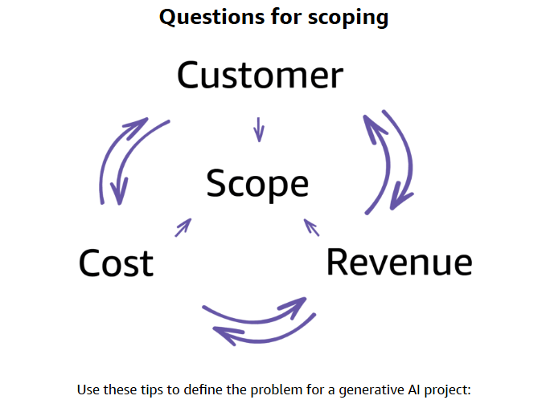

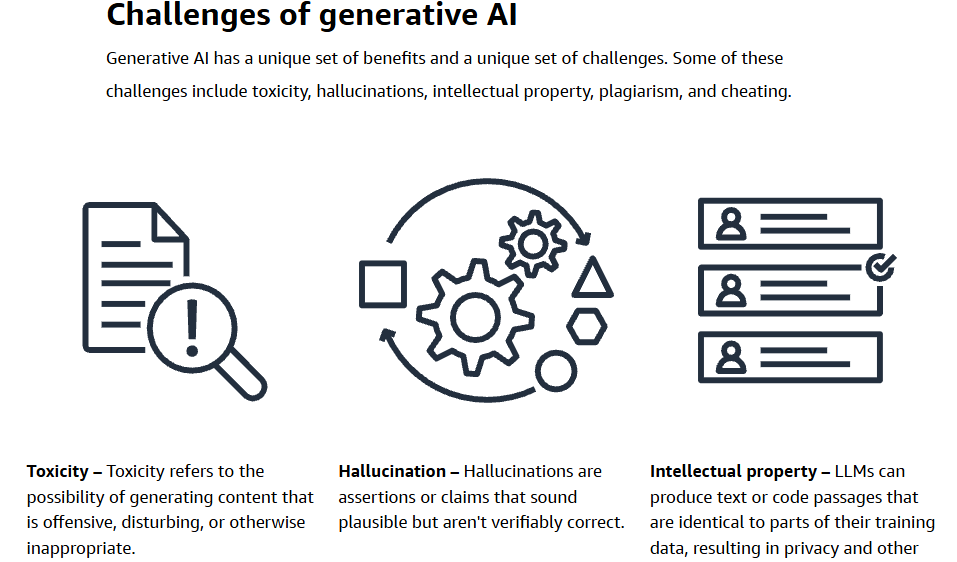

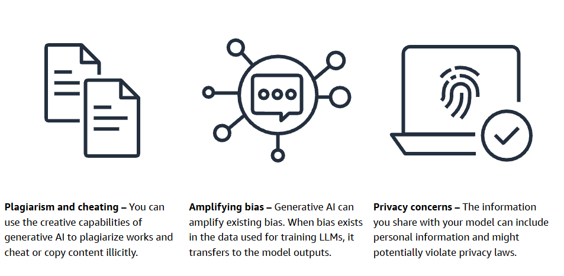

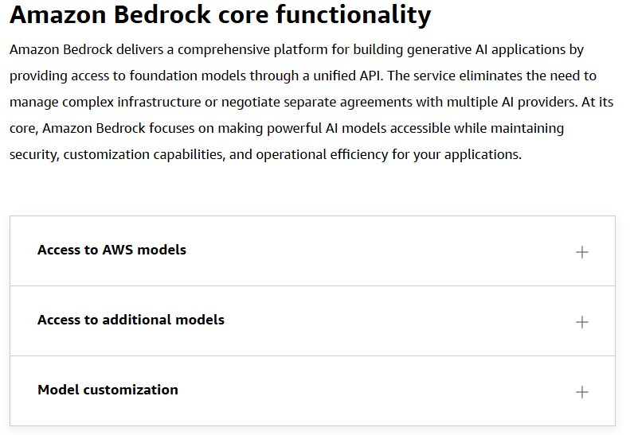

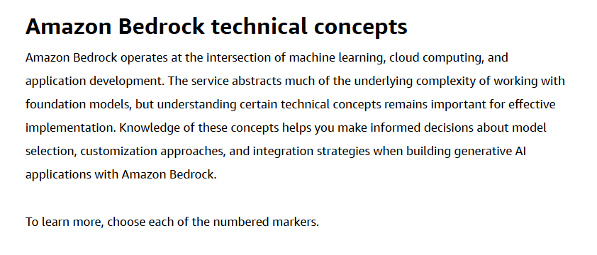

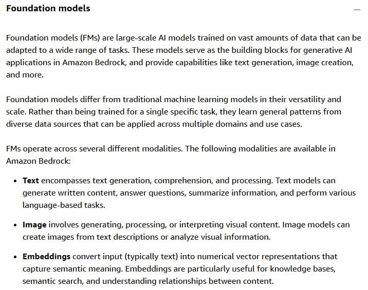

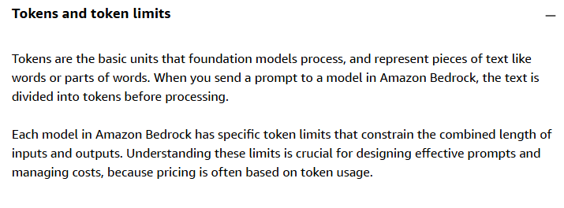

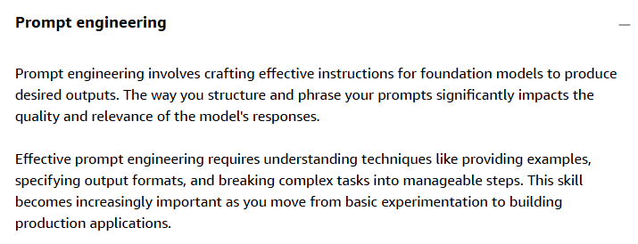

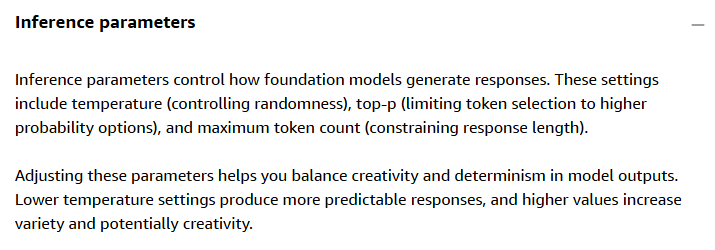

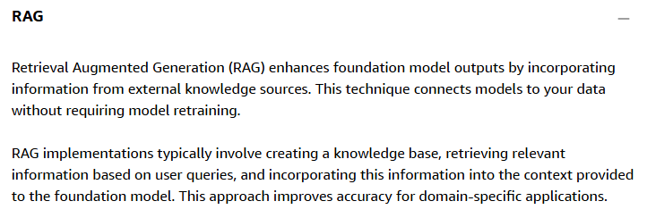

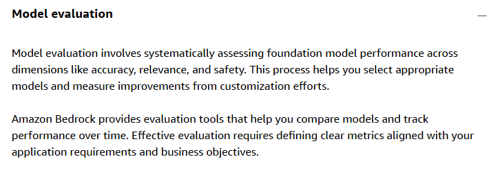

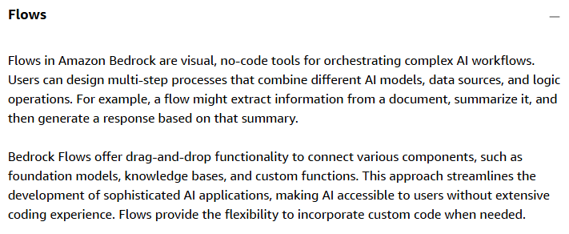

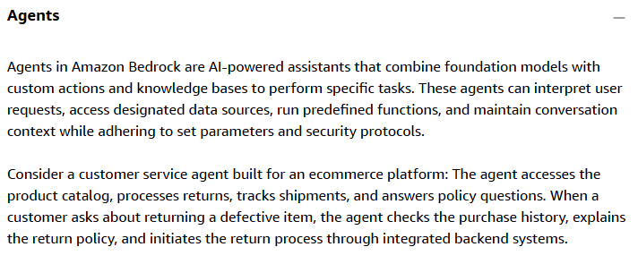

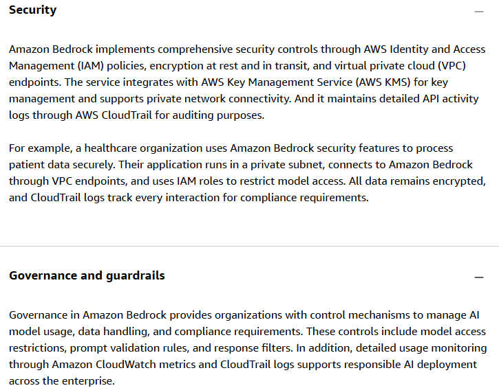

## Amazon Bedrock Architecture
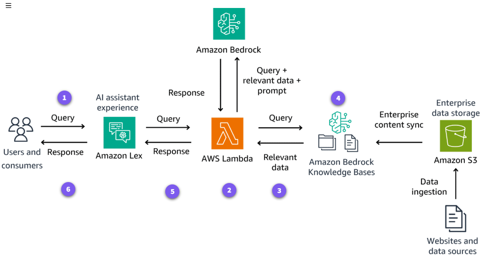

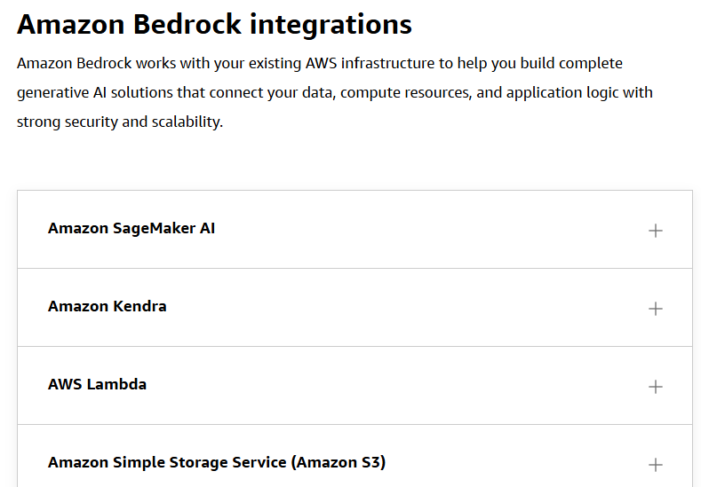
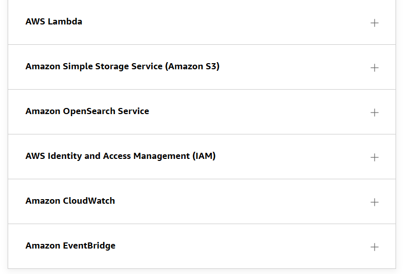

### Amazon SageMaker AI
SageMaker AI works alongside Amazon Bedrock to support the complete machine learning lifecycle. Although Amazon Bedrock provides foundation models through a simplified interface, SageMaker AI offers complementary capabilities for custom model development and deployment.

 

The integration creates workflows where data scientists use SageMaker AI for data preparation and feature engineering before using Amazon Bedrock for generative tasks. This combination provides flexibility for organizations that need both foundation models and custom machine learning models in their AI strategy.

### Amazon Kendra
Amazon Kendra enhances the Amazon Bedrock retrieval-augmented generation capabilities with enterprise search functionality. This integration connects foundation models to information stored across multiple repositories, including websites, file systems, and databases.

When combined with Amazon Bedrock, Amazon Kendra provides semantic search capabilities that understand the intent behind queries and retrieve relevant information. This powerful combination improves the accuracy and relevance of generative AI applications that need to incorporate enterprise knowledge.

### AWS Lambda
AWS Lambda runs code that orchestrates interactions between Amazon Bedrock and other services. This serverless compute service handles tasks like preprocessing inputs, formatting responses, and implementing business logic.

 

The integration with Amazon Bedrock provides event-driven architectures where Lambda functions call foundation models in response to triggers from other AWS services. This pattern supports complex workflows while maintaining a serverless operational model with automatic scaling.

### Amazon Simple Storage Service (Amazon S3)
Amazon S3 provides scalable object storage for data used with Amazon Bedrock. This integration supports multiple workflows, including storing documents for retrieval-augmented generation and managing datasets for fine-tuning.

 

Amazon Bedrock can directly access content stored in S3 buckets to streamline data workflows. This capability simplifies the process of connecting foundation models to your organization's information assets while using the durability and security features of Amazon S3.

### Amazon OpenSearch Service
OpenSearch Service works with Amazon Bedrock to implement efficient retrieval-augmented generation systems. This integration indexes documents and other content to enable semantic search capabilities that complement foundation models.

 

When a user query arrives, the system can search OpenSearch indices to find relevant information before passing it to Amazon Bedrock. This approach enhances model responses with specific, accurate information from your organization's data sources.

### AWS Identity and Access Management (IAM)
IAM controls access to Amazon Bedrock and related services. This integration implements fine-grained permissions that determine which users and applications can access specific foundation models and features.

 

IAM policies for Amazon Bedrock follow the principle of least privilege, ensuring that each entity has only the permissions required for its function. This security layer protects sensitive data and prevents unauthorized access to foundation models.

### Amazon CloudWatch
CloudWatch monitors the performance and health of Amazon Bedrock applications. This integration collects metrics, logs, and events that provide visibility into key performance indicators like response times, error rates, and usage patterns.

 

CloudWatch dashboards for Amazon Bedrock help identify issues and optimize performance. The service also supports alerts that notify you when metrics exceed thresholds, to enable proactive management of generative AI applications.

### Amazon EventBridge
EventBridge creates event-driven architectures that incorporate Amazon Bedrock capabilities. This integration enables systems where events from one service automatically trigger foundation model operations.

 

For example, a new document uploaded to Amazon S3 could trigger an EventBridge rule. That event invokes Amazon Bedrock APIs through a generative AI application to create a summary. This pattern supports automated workflows that process information as it enters your systems.

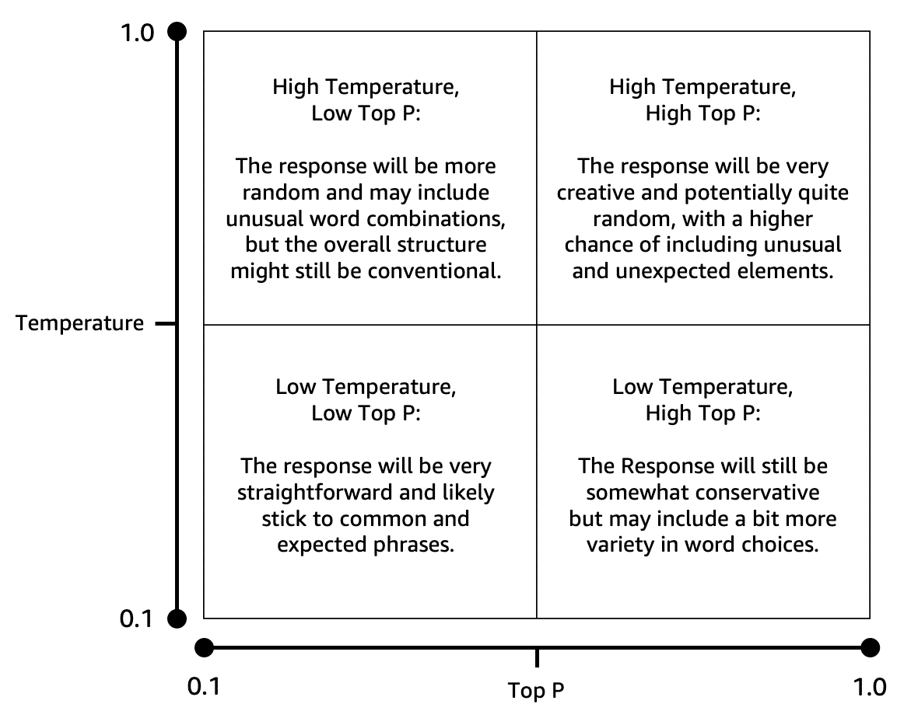

