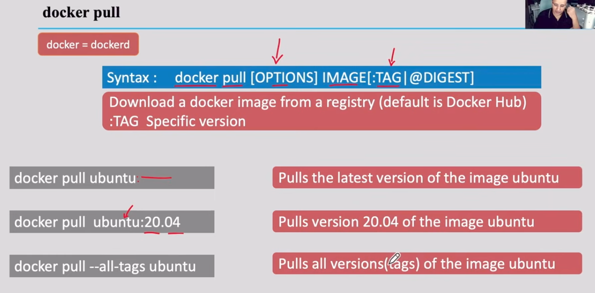

- to check if docker is enabled to run at startup ```systemctl is-enabled docker``` or ```systemctl is-enabled docker.socket``` if docker is automatically available when something else tries to access it

- check if docker is currently running ```systemctl status docker``` or ```systemctl is-active docker```

- disable docker from starting at boot
```
sudo systemctl disable docker
sudo systemctl disable docker.socket
```

- terminate docker immediately 
```
sudo systemctl stop docker
sudo systemctl stop docker.socket
```

- start docker using ```sudo systemctl start docker```

- ```docker ps``` to list running docker containers

- docker pull redis:latest

- ```docker images``` - to see the list of downloaded images

- docker pull redis:latest

- -d to run in background redis-dev is name 
```
  docker run -d \
  --name redis-dev \
  -p 6379:6379 \
  redis:latest
```
 
- docker exec -it redis-dev redis-cli

- docker stop redis-dev

- docker start redis-dev

- docker rm redis-dev

- If you want your Redis data to survive even if you delete and recreate the container, create it with a Docker volume:
```
docker run -d \
  --name redis-dev \
  -p 6379:6379 \
  -v redis-data:/data \
  redis:latest \
  redis-server --appendonly yes
```
  This stores Redis data in the Docker volume redis-data, making it a good choice for development projects where you don't want to lose data after recreating the container.

```
docker start redis-dev          # what you correctly did next
docker start -i redis-dev       # start + attach interactively
docker exec -it redis-dev sh    # get a shell inside the running container
docker attach redis-dev         # attach to its main process
```

- 
- 