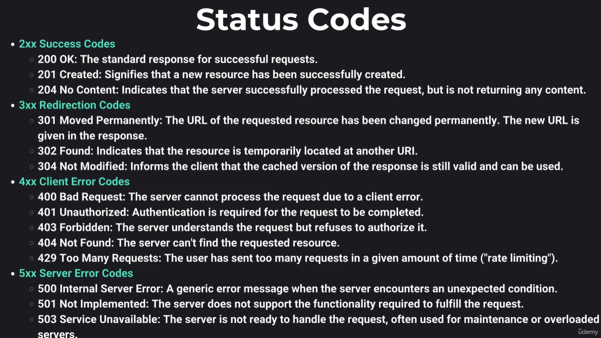
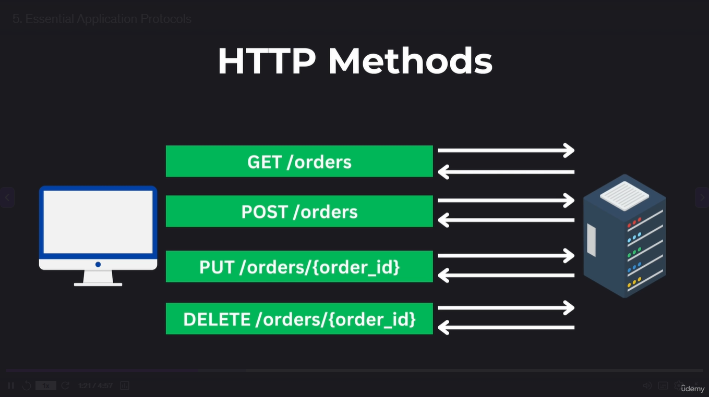
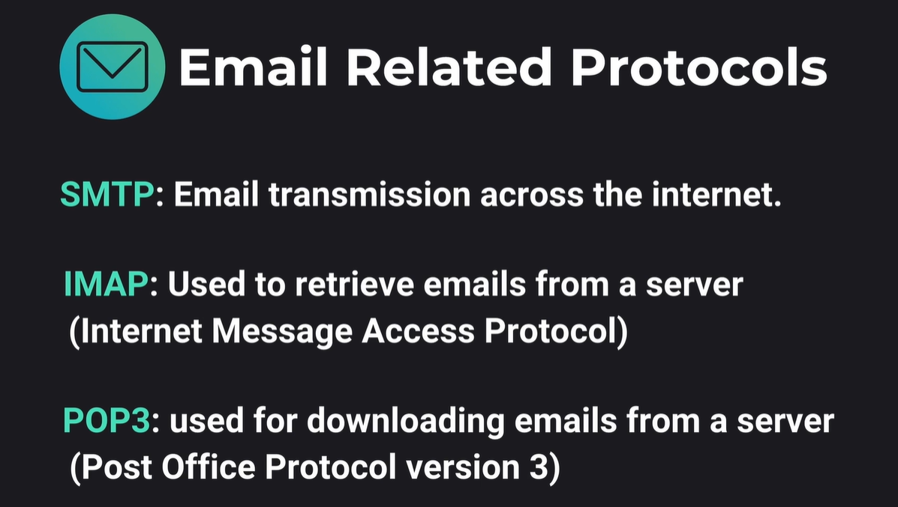
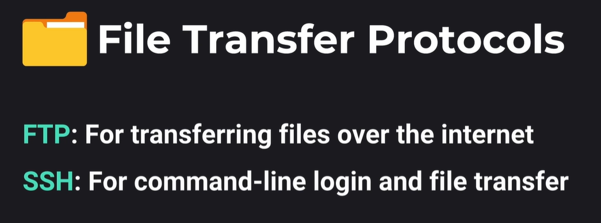
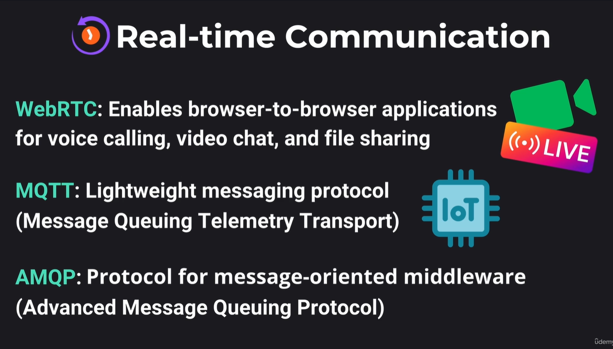
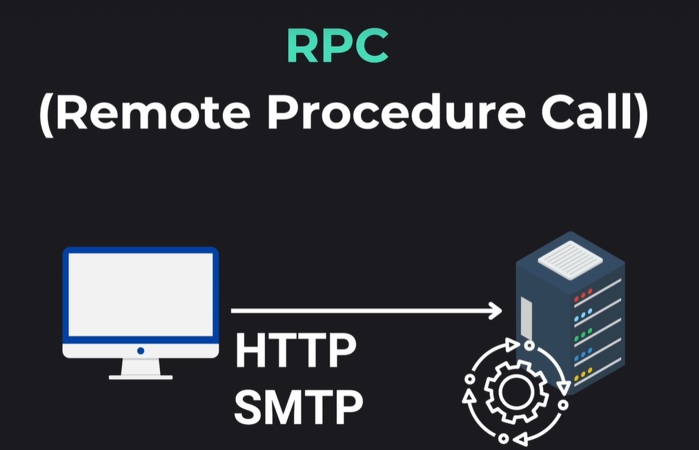

# IP Addresses
- IPv4 - 32-bit -> 4B unique IP addresses
- IPv6 - 128-bit -> 340T unique IP adresses

## Internet Protocol (IP)
Set of rules that define how data is sent and received. Computers use IP addresses to communicate to each other, IP header has the IP addresses of the Sender and the Destination

## Application Layer 
Data related to application is stored, data in this layer are formatted to application specific data

## Transport Layer
### TCP - Transmission Control Protocol
Operates at the transport layer and ensures reliable communication. TCP headers contain essential parameters like control headers to manage connection and dataflow. Known for its reliability.

It sets up a connection before delivering the data.

It has the sequence number which keeps track of the order of the packets, it uses 3-way handshake.
### UDP - User Datagram Protocol
Faster but less reliable than TCP, it doesn't set a connection before transfering data and also doesn't have a sequence number for ordering packets. 

It makes it usable while applications like video calling where some data loss is acceptable.

### DNS - Domain Name System
Managed by ICANN
- A Record - Maps domain name to its IPv4 address
- AAAA Record - Maps domain name to its IPv6 address

### Network Infrastructure
#### Public IP Address
Unique across the internet
#### Private IP Address
Unique across a local network
### Static IP Address
Residential internet connections, devices in a LAN can communicate with each other.

### Firewall
Monitoring and controlling incoming and outgoing network traffic based on security policies
### Ports
When combined with ip addresses, create a unique identifier for a service, some ports are reserved
### Dynamic IP Address

## Application Layer Protocols

Websockets provide a two-way connection between the client and the server

